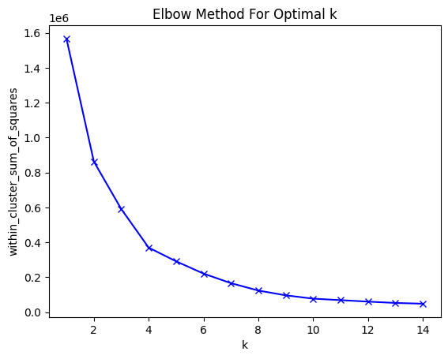
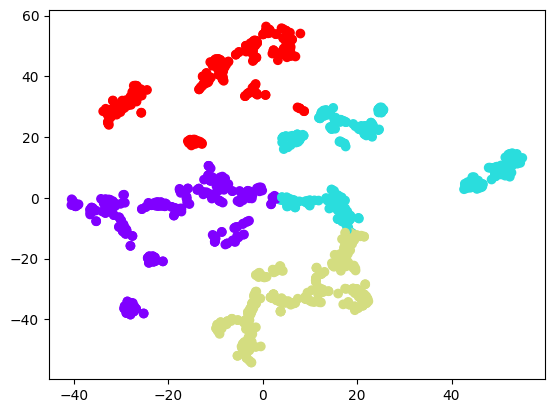
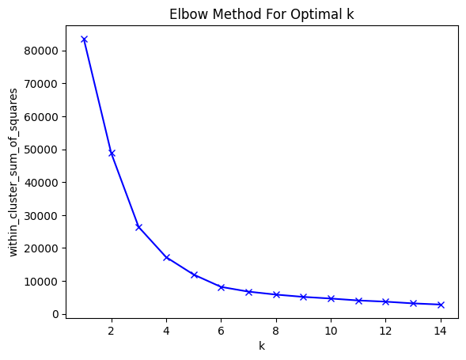
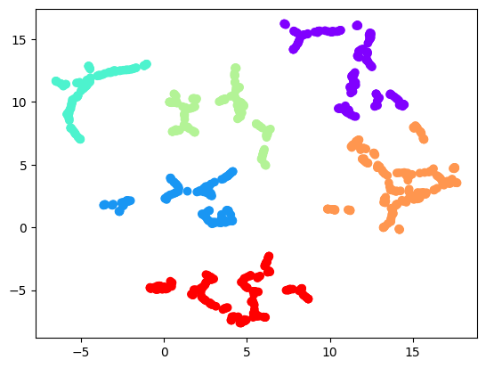

# Dimensionality Reduction
Dimensionality Reduction, visualization of reduced and embedded, clustered data, as well as hyper-parameter tuning. Further, using automated system data bricks.

There will be three notebooks produced. 

2 sets of data will be looked at, including:

>  [National Gallery of Art OpenData Github Repo](https://github.com/NationalGalleryOfArt/opendata)

> [Kaggle Cyber-Security Synthetic Data from Inscribo](https://www.kaggle.com/datasets/teamincribo/cyber-security-attacks)

### Elbow Plot for the k-Means best K on t-SNE for Artwork

### Cluster Plot for K=4 for the t-SNE matrix of Artwork

### Elbow Plot for the k-Means best K on UMAP for Synthetic Cybersecurity Data

### Cluster Plot for K=6 for the UMAP matrix of Synthetic Cybersecurity Data

## Features from the above datasets that were used:
    
    1. Features from the National Gallery of Art 'OpenData' repo. 
        - birthyear (of artist)
        - deathyear (of artist)
        - width (of artists' art)
        - height (of artists' art)
    2. Features from the synthetic Kaggle dataset on cyber-security attacks.
        - Source Port
        - Destination Port
        - Packet Length
        - Anomaly Scores

## Notebooks above cover:

1) Dimensionality reduction on it's own on various sets of data. Techniques applied include:

    a) Lower Complexity Algorithms

        1. PCA (Principal Component Analysis)
        2. SVD (Singular Value Decomposition)
        3. MDS (Multidimensional Scaling)
        4. ISOMap (Isometric Mapping)
        5. LLE (Locally Linear Embedding)
   
    b) Higher Complexity Algorithms

        1. UMAP (Uniform Manifold Approximation and Projection)
        2. t-sne (t-Distributed Stochastic Neighbor Embedding)

2) Dimensionality reduction was followed by clustering on the UMAP and t-SNE dimensionality reduced data for art from notebook 1.
3) Dimensionality reduction done using the Data Bricks platform (similar to 1, except using the databricks platform for data storage and multi-process / scaling).
